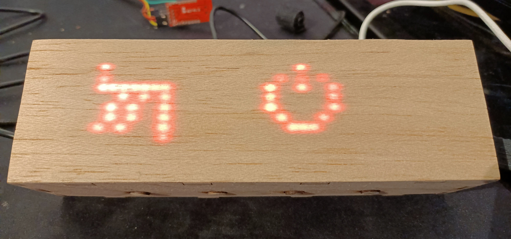

# ZauberBoxOp
A "ZauberBox" with Buttons - Software uses final state machines to send various commands via MQTT

# Software

## Build

* To be build with Platformio
* `pio run` will install dependencies and build the software
* `pio run --target=upload` will upload the software

## Configuration

* Create `data/config/homie.json` with Wifi/MQTT credentials as described at https://homieiot.github.io/homie-esp8266/docs/stable/configuration/json-configuration-file/
* Upload it with `pio run --target=uploadfs`

## Debug

* Connect serial monitor with baudrate 74880 to your device. (This baudrate is used by the bootloader, so it is used in the software too, so you can see all messages).

# How to build the Box

* detailed instructions comming soon

* Optional: Adapt FreeCAD project to your needs (other sizes) and export SVG files for laser cutter
* Use SVG files to lasercut the case
* Use some pushbuttons and connect them to your ESP8266: no pullup resistors needed: just connect the inputs D1, D2, D3, and D4 to a button and connect the NO contact of each button to GND.
* Connect a 32*8 LED Matrix to SS, CLK, MOSI, MISO of your D1 Mini
* drill a hole for 5V power supply (or higher supply and use a DCDC converter for 5V)
* glue eveything together (I wood is of good quality you don't need that much glue)
* Glue a very thin piece of wood (balsa etc.) to the front
* When glue has dried, sand the box to smoothen surfaces

# Example for OpenHAB integration

See [OpenHAB integration](doc/OpenHAB/README.MD)
